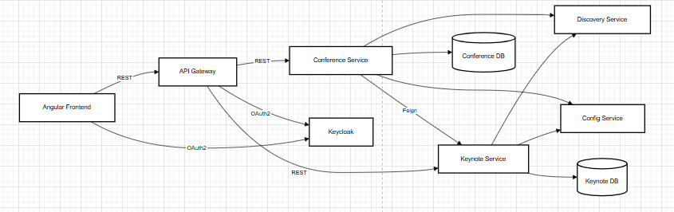
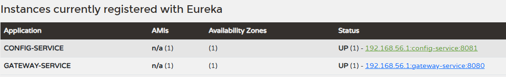
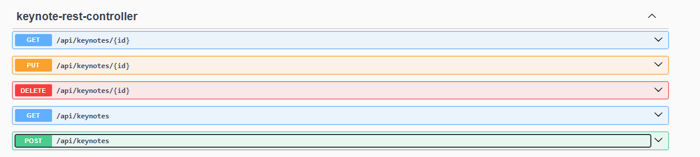

# Application basée sur une architecture micro-service qui permet de gérer des conférences assurées par des Keynote

## 1- Établir une architecture technique du projet



## 2- Créer un Projet Maven incluant les micro-services suivants : keynote-service, conference-service, gateway-service, discovery-service, config-service et angular-front-app


## 3- Développer et tester les micro-services discovery-service et gateway-service et config-service

Les micro-services discovery-service (Eureka Server), config-service (Spring Cloud Config) et gateway-service (Spring Cloud Gateway) sont développés et testés.



## 4- Developper et tester le micro-service Keynote-service (Entities, DAO, service, DTO, Mapper, RestController)

Entity (Keynote):
```java
@Entity
@Table(name = "keynotes")
public class Keynote {
    @Id
    @GeneratedValue(strategy = GenerationType.IDENTITY)
    private Long id;
    private String nom;
    private String prenom;
    private String email;
    private String fonction;
}
```

DTO:
```java
public class KeynoteDto {
    private Long id;
    private String nom;
    private String prenom;
    private String email;
    private String fonction;
}
```

Repository:
```java
public interface KeynoteRepository extends JpaRepository<Keynote, Long> {
}
```

Service:
```java
public interface KeynoteService {
    KeynoteDto create(KeynoteDto dto);
    KeynoteDto update(Long id, KeynoteDto dto);
    void delete(Long id);
    KeynoteDto getById(Long id);
    List<KeynoteDto> getAll();
}
```

Web (RestController):
```java
@RestController
@RequestMapping("/api/keynotes")
public class KeynoteRestController {
    @PostMapping
    public KeynoteDto create(@RequestBody KeynoteDto dto) { ... }
    @GetMapping("/{id}")
    public KeynoteDto getById(@PathVariable Long id) { ... }
    @GetMapping
    public List<KeynoteDto> getAll() { ... }
    @PutMapping("/{id}")
    public KeynoteDto update(@PathVariable Long id, @RequestBody KeynoteDto dto) { ... }
    @DeleteMapping("/{id}")
    public void delete(@PathVariable Long id) { ... }
}
```


