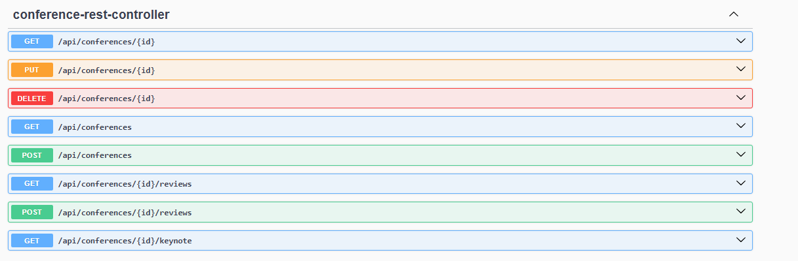
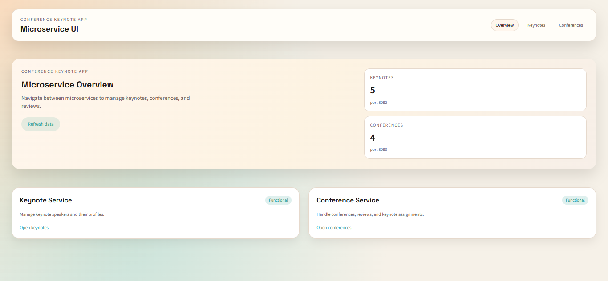
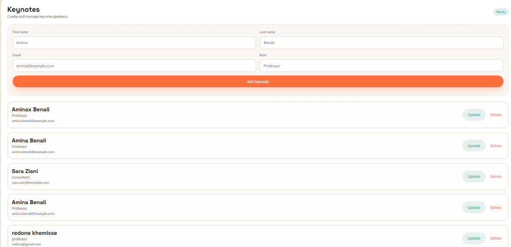
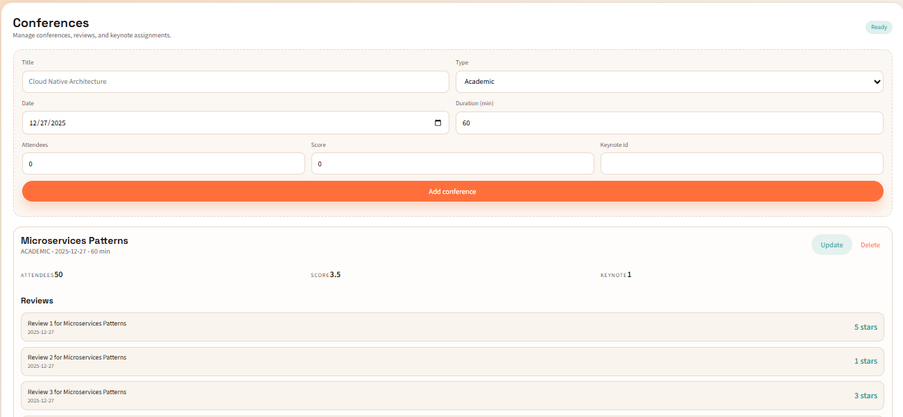

# Application basée sur une architecture micro-service qui permet de gérer des conférences assurées par des Keynote

## 1- Établir une architecture technique du projet


## 2- Créer un Projet Maven incluant les micro-services suivants : keynote-service, conference-service, gateway-service, discovery-service, config-service et angular-front-app


## 3- Développer et tester les micro-services discovery-service et gateway-service et config-service

Les micro-services discovery-service (Eureka Server), config-service (Spring Cloud Config) et gateway-service (Spring Cloud Gateway) sont développés et testés.


## 4- Developper et tester le micro-service Keynote-service (Entities, DAO, service, DTO, Mapper, RestController)

Entity (Keynote):
```java
@Entity
@Table(name = "keynotes")
public class Keynote {
    @Id
    @GeneratedValue(strategy = GenerationType.IDENTITY)
    private Long id;
    private String nom;
    private String prenom;
    private String email;
    private String fonction;
}
```

DTO:
```java
public class KeynoteDto {
    private Long id;
    private String nom;
    private String prenom;
    private String email;
    private String fonction;
}
```

Repository:
```java
public interface KeynoteRepository extends JpaRepository<Keynote, Long> {
}
```

Service:
```java
public interface KeynoteService {
    KeynoteDto create(KeynoteDto dto);
    KeynoteDto update(Long id, KeynoteDto dto);
    void delete(Long id);
    KeynoteDto getById(Long id);
    List<KeynoteDto> getAll();
}
```

Web (RestController):
```java
@RestController
@RequestMapping("/api/keynotes")
public class KeynoteRestController {
    @PostMapping
    public KeynoteDto create(@RequestBody KeynoteDto dto) { ... }
    @GetMapping("/{id}")
    public KeynoteDto getById(@PathVariable Long id) { ... }
    @GetMapping
    public List<KeynoteDto> getAll() { ... }
    @PutMapping("/{id}")
    public KeynoteDto update(@PathVariable Long id, @RequestBody KeynoteDto dto) { ... }
    @DeleteMapping("/{id}")
    public void delete(@PathVariable Long id) { ... }
}
```


## 5- Developper et tester le micro-service conference-service (Entities, DAO, service, DTO, Mapper, RestController, Client Rest Open Feign)

Entity (Conference, Review):
```java
@Entity
@Table(name = "conferences")
public class Conference {
    @Id
    @GeneratedValue(strategy = GenerationType.IDENTITY)
    private Long id;
    private String titre;
    @Enumerated(EnumType.STRING)
    private ConferenceType type;
    private LocalDate date;
    private Integer duree;
    private Integer nombreInscrits;
    private Double score;
    private Long keynoteId;
    @OneToMany(mappedBy = "conference", cascade = CascadeType.ALL, orphanRemoval = true)
    private List<Review> reviews;
}
```

```java
@Entity
@Table(name = "reviews")
public class Review {
    @Id
    @GeneratedValue(strategy = GenerationType.IDENTITY)
    private Long id;
    private LocalDate date;
    private String texte;
    private Integer stars;
}
```

DTO (ConferenceDto, ReviewDto):
```java
public class ConferenceDto {
    private Long id;
    private String titre;
    private ConferenceType type;
    private LocalDate date;
    private Integer duree;
    private Integer nombreInscrits;
    private Double score;
    private Long keynoteId;
    private List<ReviewDto> reviews;
}
```

```java
public class ReviewDto {
    private Long id;
    private LocalDate date;
    private String texte;
    private Integer stars;
}
```

Repository:
```java
public interface ConferenceRepository extends JpaRepository<Conference, Long> {
}
```

Service:
```java
public interface ConferenceService {
    ConferenceDto create(ConferenceDto dto);
    ConferenceDto update(Long id, ConferenceDto dto);
    void delete(Long id);
    ConferenceDto getById(Long id);
    List<ConferenceDto> getAll();
    ReviewDto addReview(Long conferenceId, ReviewDto reviewDto);
    List<ReviewDto> getReviews(Long conferenceId);
    KeynoteDto getKeynote(Long conferenceId);
}
```

Feign Client:
```java
@FeignClient(name = "keynote-service")
public interface KeynoteClient {
    @GetMapping("/api/keynotes/{id}")
    KeynoteDto getKeynoteById(@PathVariable("id") Long id);
}
```

Web (RestController):
```java
@RestController
@RequestMapping("/api/conferences")
public class ConferenceRestController {
    @PostMapping
    public ConferenceDto create(@RequestBody ConferenceDto dto) { ... }
    @GetMapping("/{id}")
    public ConferenceDto getById(@PathVariable Long id) { ... }
    @GetMapping
    public List<ConferenceDto> getAll() { ... }
    @PutMapping("/{id}")
    public ConferenceDto update(@PathVariable Long id, @RequestBody ConferenceDto dto) { ... }
    @PostMapping("/{id}/reviews")
    public ReviewDto addReview(@PathVariable Long id, @RequestBody ReviewDto dto) { ... }
    @GetMapping("/{id}/reviews")
    public List<ReviewDto> getReviews(@PathVariable Long id) { ... }
}
```



## 6- Developper un simple frontend web pour l application

Frontend Angular (multi-pages) dans `angular-front-app`.

Routing (pages principales):
```ts
export const routes: Routes = [
  { path: '', redirectTo: 'overview', pathMatch: 'full' },
  { path: 'overview', component: OverviewComponent },
  { path: 'keynotes', component: KeynotesComponent },
  { path: 'conferences', component: ConferencesComponent }
];
```

API calls (services):
```ts
private readonly keynoteBase = 'http://localhost:8082/api/keynotes';
private readonly conferenceBase = 'http://localhost:8083/api/conferences';

getKeynotes(): Observable<Keynote[]> { ... }
createKeynote(payload: Keynote): Observable<Keynote> { ... }
updateKeynote(id: number, payload: Keynote): Observable<Keynote> { ... }
```

Keynotes UI (create/update):
```ts
addKeynote(): void {
  if (this.editingId != null) {
    this.api.updateKeynote(this.editingId, this.keynoteForm).subscribe(...);
  } else {
    this.api.createKeynote(this.keynoteForm).subscribe(...);
  }
}
```

Conferences UI (create/reviews):
```ts
addReview(conferenceId: number): void {
  this.api.addReview(conferenceId, draft).subscribe(...);
}
```




